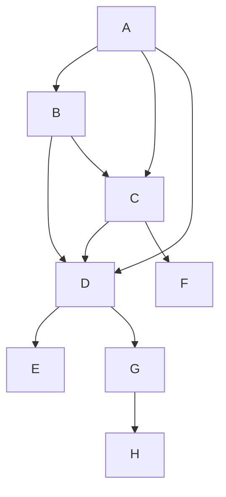

Test


Test 2
```mermaid
  graph LR;
build -->Build-and-publish::ml-builds ;
preamble -->Build-Assets::build-docker ;
preamble -->Build-Assets::build-bare-metal ;
preamble,build-docker,build-bare-metal -->Build-Assets::build-bare-metal-eclide ;
pre_job -->Build-Test-ECL-Watch::build ;
Test-Build::build-workflow-dispatch --> Build Package (Docker) ;
build-workflow-dispatch -->Test-Build::test-workflow-dispatch --> Smoketest Package (gh-runner) ;
Test-Build::build-docker-ubuntu-23_10 --> Build Package (Docker) ;
Test-Build::build-docker-ubuntu-22_04 --> Build Package (Docker) ;
build-docker-ubuntu-22_04 -->Test-Build::test-smoke-docker-ubuntu-22_04 --> Smoketest Package (gh-runner) ;
Test-Build::test-regression-suite-k8s-ubuntu-22_04 --> Regression Suite on K8s ;
build-docker-ubuntu-22_04 -->Test-Build::test-unit-docker-ubuntu-22_04 --> Unittest Package (gh-runner) ;
build-docker-ubuntu-22_04 -->Test-Build::test-ui-docker-ubuntu-22_04 --> UI test Package (gh-runner) ;
Test-Build::build-docker-ubuntu-20_04 --> Build Package (Docker) ;
Test-Build::build-docker-centos-8 --> Build Package (Docker) ;
Test-Build::build-docker-centos-7 --> Build Package (Docker) ;
Test-Build::build-docker-amazonlinux --> Build Package (Docker) ;
Test-Build::build-gh_runner-ubuntu-22_04 --> Build Package (gh-runner) ;
Test-Build::build-gh_runner-ubuntu-20_04 --> Build Package (gh-runner) ;
Test-Build::build-gh_runner-windows-2022 --> Build Package (gh-runner) ;
Test-Build::build-gh_runner-windows-2019 --> Build Package (gh-runner) ;
Test-Build::build-gh_runner-macos-12 --> Build Package (gh-runner) ;
Test-Build::build-gh_runner-macos-11 --> Build Package (gh-runner) ;
pre_job -->CodeQL-ECL-Watch::analyze ;
pre_job -->Run-helm-chart-tests::build ;
Regression-Suite-on-K8s::build-docker --> Build Package (Docker) ;
build-docker -->Regression-Suite-on-K8s::main ;
main -->Regression-Suite-on-K8s::succeeded ;
main -->Smoketest-Package-gh-runner::succeeded ;
```
