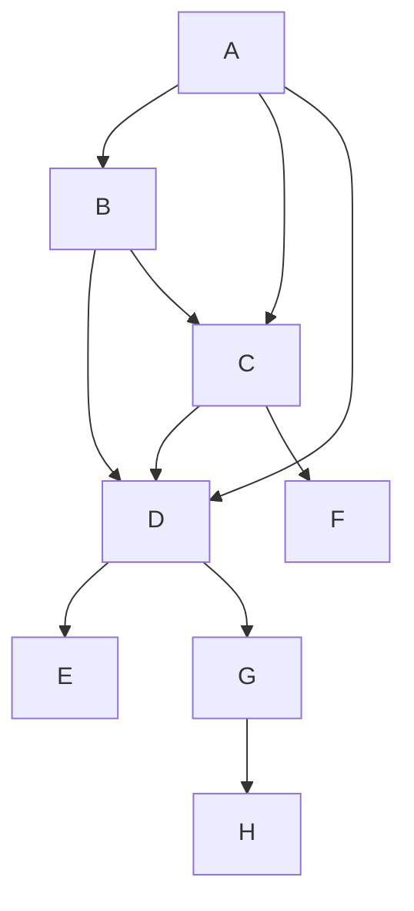
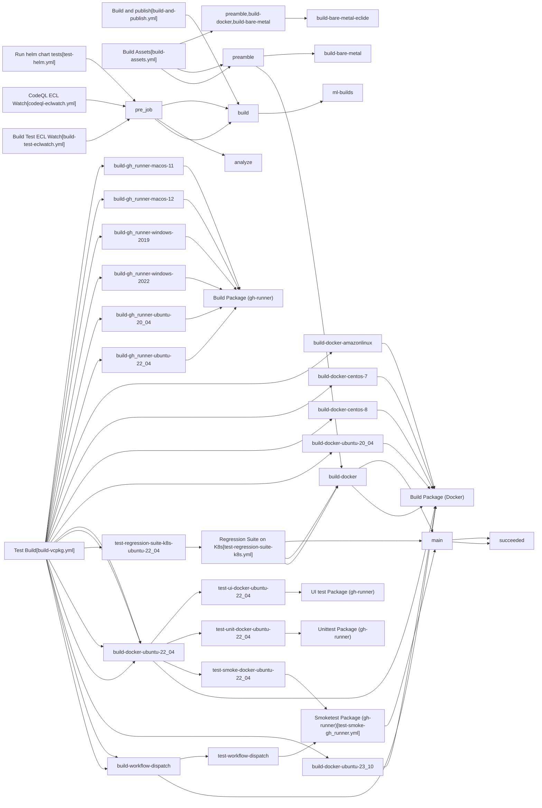

Test

```mermaid
  graph TD;
      A-->B;
      A-->C;
      B-->D;
      C-->D;
      A-->D-->E;
      B-->C-->F;
      D-->G-->H;
```
Test 2

```mermaid
  graph LR;
Build_and_publish["Build and publish[build-and-publish.yml]"]-->build -->ml-builds["ml-builds"] ;
Build_Assets["Build Assets[build-assets.yml]"]-->preamble -->build-docker["build-docker"] ;
Build_Assets["Build Assets[build-assets.yml]"]-->preamble -->build-bare-metal["build-bare-metal"] ;
Build_Assets["Build Assets[build-assets.yml]"]-->preamble,build-docker,build-bare-metal -->build-bare-metal-eclide["build-bare-metal-eclide"] ;
Build_Test_ECL_Watch["Build Test ECL Watch[build-test-eclwatch.yml]"]-->pre_job -->build["build"] ;
Test_Build["Test Build[build-vcpkg.yml]"]-->build-workflow-dispatch["build-workflow-dispatch"] --> Build_Package_-Docker-["Build Package (Docker)"] ;
Test_Build["Test Build[build-vcpkg.yml]"]-->build-workflow-dispatch -->test-workflow-dispatch["test-workflow-dispatch"] --> Smoketest_Package_-gh-runner-["Smoketest Package (gh-runner)"] ;
Test_Build["Test Build[build-vcpkg.yml]"]-->build-docker-ubuntu-23_10["build-docker-ubuntu-23_10"] --> Build_Package_-Docker-["Build Package (Docker)"] ;
Test_Build["Test Build[build-vcpkg.yml]"]-->build-docker-ubuntu-22_04["build-docker-ubuntu-22_04"] --> Build_Package_-Docker-["Build Package (Docker)"] ;
Test_Build["Test Build[build-vcpkg.yml]"]-->build-docker-ubuntu-22_04 -->test-smoke-docker-ubuntu-22_04["test-smoke-docker-ubuntu-22_04"] --> Smoketest_Package_-gh-runner-["Smoketest Package (gh-runner)"] ;
Test_Build["Test Build[build-vcpkg.yml]"]-->test-regression-suite-k8s-ubuntu-22_04["test-regression-suite-k8s-ubuntu-22_04"] --> Regression_Suite_on_K8s["Regression Suite on K8s"] ;
Test_Build["Test Build[build-vcpkg.yml]"]-->build-docker-ubuntu-22_04 -->test-unit-docker-ubuntu-22_04["test-unit-docker-ubuntu-22_04"] --> Unittest_Package_-gh-runner-["Unittest Package (gh-runner)"] ;
Test_Build["Test Build[build-vcpkg.yml]"]-->build-docker-ubuntu-22_04 -->test-ui-docker-ubuntu-22_04["test-ui-docker-ubuntu-22_04"] --> UI_test_Package_-gh-runner-["UI test Package (gh-runner)"] ;
Test_Build["Test Build[build-vcpkg.yml]"]-->build-docker-ubuntu-20_04["build-docker-ubuntu-20_04"] --> Build_Package_-Docker-["Build Package (Docker)"] ;
Test_Build["Test Build[build-vcpkg.yml]"]-->build-docker-centos-8["build-docker-centos-8"] --> Build_Package_-Docker-["Build Package (Docker)"] ;
Test_Build["Test Build[build-vcpkg.yml]"]-->build-docker-centos-7["build-docker-centos-7"] --> Build_Package_-Docker-["Build Package (Docker)"] ;
Test_Build["Test Build[build-vcpkg.yml]"]-->build-docker-amazonlinux["build-docker-amazonlinux"] --> Build_Package_-Docker-["Build Package (Docker)"] ;
Test_Build["Test Build[build-vcpkg.yml]"]-->build-gh_runner-ubuntu-22_04["build-gh_runner-ubuntu-22_04"] --> Build_Package_-gh-runner-["Build Package (gh-runner)"] ;
Test_Build["Test Build[build-vcpkg.yml]"]-->build-gh_runner-ubuntu-20_04["build-gh_runner-ubuntu-20_04"] --> Build_Package_-gh-runner-["Build Package (gh-runner)"] ;
Test_Build["Test Build[build-vcpkg.yml]"]-->build-gh_runner-windows-2022["build-gh_runner-windows-2022"] --> Build_Package_-gh-runner-["Build Package (gh-runner)"] ;
Test_Build["Test Build[build-vcpkg.yml]"]-->build-gh_runner-windows-2019["build-gh_runner-windows-2019"] --> Build_Package_-gh-runner-["Build Package (gh-runner)"] ;
Test_Build["Test Build[build-vcpkg.yml]"]-->build-gh_runner-macos-12["build-gh_runner-macos-12"] --> Build_Package_-gh-runner-["Build Package (gh-runner)"] ;
Test_Build["Test Build[build-vcpkg.yml]"]-->build-gh_runner-macos-11["build-gh_runner-macos-11"] --> Build_Package_-gh-runner-["Build Package (gh-runner)"] ;
CodeQL_ECL_Watch["CodeQL ECL Watch[codeql-eclwatch.yml]"]-->pre_job -->analyze["analyze"] ;
Run_helm_chart_tests["Run helm chart tests[test-helm.yml]"]-->pre_job -->build["build"] ;
Regression_Suite_on_K8s["Regression Suite on K8s[test-regression-suite-k8s.yml]"]-->build-docker["build-docker"] --> Build_Package_-Docker-["Build Package (Docker)"] ;
Regression_Suite_on_K8s["Regression Suite on K8s[test-regression-suite-k8s.yml]"]-->build-docker -->main["main"] ;
Regression_Suite_on_K8s["Regression Suite on K8s[test-regression-suite-k8s.yml]"]-->main -->succeeded["succeeded"] ;
Smoketest_Package_-gh-runner-["Smoketest Package (gh-runner)[test-smoke-gh_runner.yml]"]-->main -->succeeded["succeeded"] ;
```
