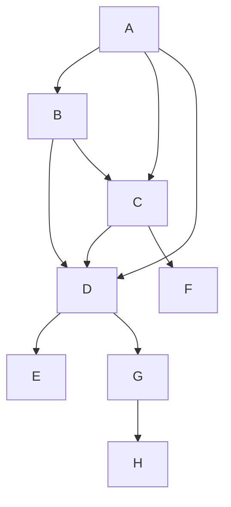
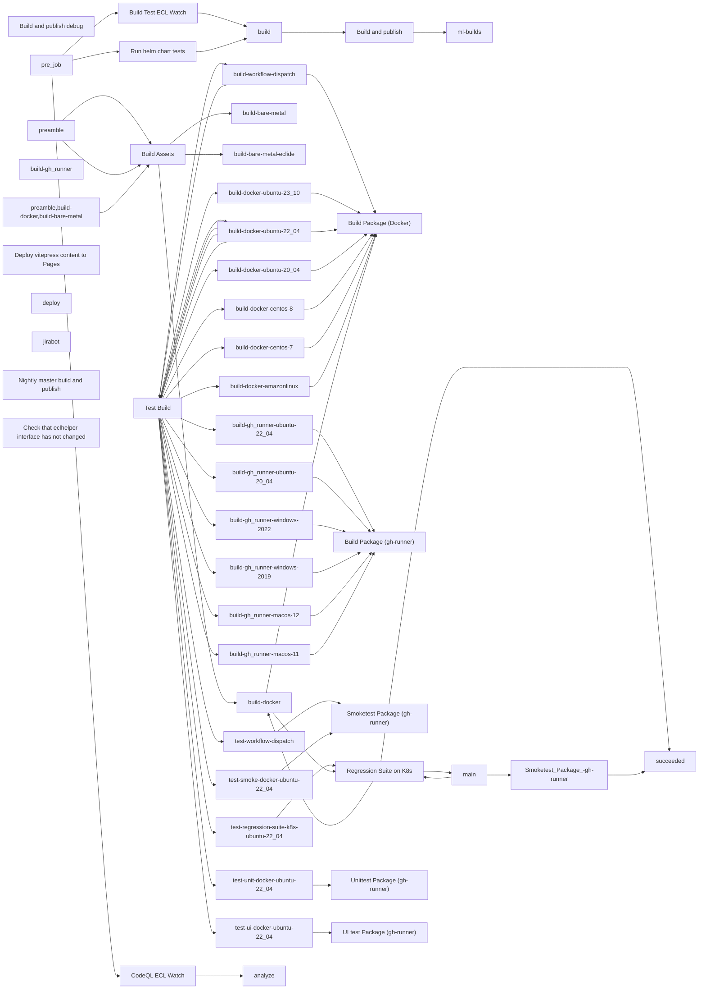

Test

```mermaid
  graph TD;
      A-->B;
      A-->C;
      B-->D;
      C-->D;
      A-->D-->E;
      B-->C-->F;
      D-->G-->H;
```
Test 2

```mermaid
  graph LR;
Build_and_publish_debug["Build and publish debug"]
build["build"]
Build_and_publish["Build and publish"]
build["build"]
ml-builds["ml-builds"]
build -->Build_and_publish-->ml-builds ;
Build_Assets["Build Assets"]
preamble["preamble"]
build-docker["build-docker"]
preamble -->Build_Assets-->build-docker ;
build-bare-metal["build-bare-metal"]
preamble -->Build_Assets-->build-bare-metal ;
build-bare-metal-eclide["build-bare-metal-eclide"]
preamble,build-docker,build-bare-metal -->Build_Assets-->build-bare-metal-eclide ;
Build_Package_-Docker-["Build Package (Docker)"]
build-docker["build-docker"]
Build_Package_-gh-runner-["Build Package (gh-runner)"]
build-gh_runner["build-gh_runner"]
Build_Test_ECL_Watch["Build Test ECL Watch"]
pre_job["pre_job"]
build["build"]
pre_job -->Build_Test_ECL_Watch-->build ;
Test_Build["Test Build"]
build-workflow-dispatch["build-workflow-dispatch"]
Build_Package_-Docker-["Build Package (Docker)"]
Test_Build-->build-workflow-dispatch --> Build_Package_-Docker- ;
test-workflow-dispatch["test-workflow-dispatch"]
Smoketest_Package_-gh-runner-["Smoketest Package (gh-runner)"]
build-workflow-dispatch -->Test_Build-->test-workflow-dispatch --> Smoketest_Package_-gh-runner- ;
build-docker-ubuntu-23_10["build-docker-ubuntu-23_10"]
Build_Package_-Docker-["Build Package (Docker)"]
Test_Build-->build-docker-ubuntu-23_10 --> Build_Package_-Docker- ;
build-docker-ubuntu-22_04["build-docker-ubuntu-22_04"]
Build_Package_-Docker-["Build Package (Docker)"]
Test_Build-->build-docker-ubuntu-22_04 --> Build_Package_-Docker- ;
test-smoke-docker-ubuntu-22_04["test-smoke-docker-ubuntu-22_04"]
Smoketest_Package_-gh-runner-["Smoketest Package (gh-runner)"]
build-docker-ubuntu-22_04 -->Test_Build-->test-smoke-docker-ubuntu-22_04 --> Smoketest_Package_-gh-runner- ;
test-regression-suite-k8s-ubuntu-22_04["test-regression-suite-k8s-ubuntu-22_04"]
Regression_Suite_on_K8s["Regression Suite on K8s"]
Test_Build-->test-regression-suite-k8s-ubuntu-22_04 --> Regression_Suite_on_K8s ;
test-unit-docker-ubuntu-22_04["test-unit-docker-ubuntu-22_04"]
Unittest_Package_-gh-runner-["Unittest Package (gh-runner)"]
build-docker-ubuntu-22_04 -->Test_Build-->test-unit-docker-ubuntu-22_04 --> Unittest_Package_-gh-runner- ;
test-ui-docker-ubuntu-22_04["test-ui-docker-ubuntu-22_04"]
UI_test_Package_-gh-runner-["UI test Package (gh-runner)"]
build-docker-ubuntu-22_04 -->Test_Build-->test-ui-docker-ubuntu-22_04 --> UI_test_Package_-gh-runner- ;
build-docker-ubuntu-20_04["build-docker-ubuntu-20_04"]
Build_Package_-Docker-["Build Package (Docker)"]
Test_Build-->build-docker-ubuntu-20_04 --> Build_Package_-Docker- ;
build-docker-centos-8["build-docker-centos-8"]
Build_Package_-Docker-["Build Package (Docker)"]
Test_Build-->build-docker-centos-8 --> Build_Package_-Docker- ;
build-docker-centos-7["build-docker-centos-7"]
Build_Package_-Docker-["Build Package (Docker)"]
Test_Build-->build-docker-centos-7 --> Build_Package_-Docker- ;
build-docker-amazonlinux["build-docker-amazonlinux"]
Build_Package_-Docker-["Build Package (Docker)"]
Test_Build-->build-docker-amazonlinux --> Build_Package_-Docker- ;
build-gh_runner-ubuntu-22_04["build-gh_runner-ubuntu-22_04"]
Build_Package_-gh-runner-["Build Package (gh-runner)"]
Test_Build-->build-gh_runner-ubuntu-22_04 --> Build_Package_-gh-runner- ;
build-gh_runner-ubuntu-20_04["build-gh_runner-ubuntu-20_04"]
Build_Package_-gh-runner-["Build Package (gh-runner)"]
Test_Build-->build-gh_runner-ubuntu-20_04 --> Build_Package_-gh-runner- ;
build-gh_runner-windows-2022["build-gh_runner-windows-2022"]
Build_Package_-gh-runner-["Build Package (gh-runner)"]
Test_Build-->build-gh_runner-windows-2022 --> Build_Package_-gh-runner- ;
build-gh_runner-windows-2019["build-gh_runner-windows-2019"]
Build_Package_-gh-runner-["Build Package (gh-runner)"]
Test_Build-->build-gh_runner-windows-2019 --> Build_Package_-gh-runner- ;
build-gh_runner-macos-12["build-gh_runner-macos-12"]
Build_Package_-gh-runner-["Build Package (gh-runner)"]
Test_Build-->build-gh_runner-macos-12 --> Build_Package_-gh-runner- ;
build-gh_runner-macos-11["build-gh_runner-macos-11"]
Build_Package_-gh-runner-["Build Package (gh-runner)"]
Test_Build-->build-gh_runner-macos-11 --> Build_Package_-gh-runner- ;
CodeQL_ECL_Watch["CodeQL ECL Watch"]
pre_job["pre_job"]
analyze["analyze"]
pre_job -->CodeQL_ECL_Watch-->analyze ;
Deploy_vitepress_content_to_Pages["Deploy vitepress content to Pages"]
deploy["deploy"]
jirabot["jirabot"]
jirabot["jirabot"]
Nightly_master_build_and_publish["Nightly master build and publish"]
build["build"]
Check_that_eclhelper_interface_has_not_changed["Check that eclhelper interface has not changed"]
build["build"]
Run_helm_chart_tests["Run helm chart tests"]
pre_job["pre_job"]
build["build"]
pre_job -->Run_helm_chart_tests-->build ;
Regression_Suite_on_K8s["Regression Suite on K8s"]
build-docker["build-docker"]
Build_Package_-Docker-["Build Package (Docker)"]
Regression_Suite_on_K8s-->build-docker --> Build_Package_-Docker- ;
main["main"]
build-docker -->Regression_Suite_on_K8s-->main ;
succeeded["succeeded"]
main -->Regression_Suite_on_K8s-->succeeded ;
Smoketest_Package_-gh-runner-["Smoketest Package (gh-runner)"]
main["main"]
succeeded["succeeded"]
main -->Smoketest_Package_-gh-runner--->succeeded ;
UI_test_Package_-gh-runner-["UI test Package (gh-runner)"]
main["main"]
Unittest_Package_-gh-runner-["Unittest Package (gh-runner)"]
main["main"]
```
