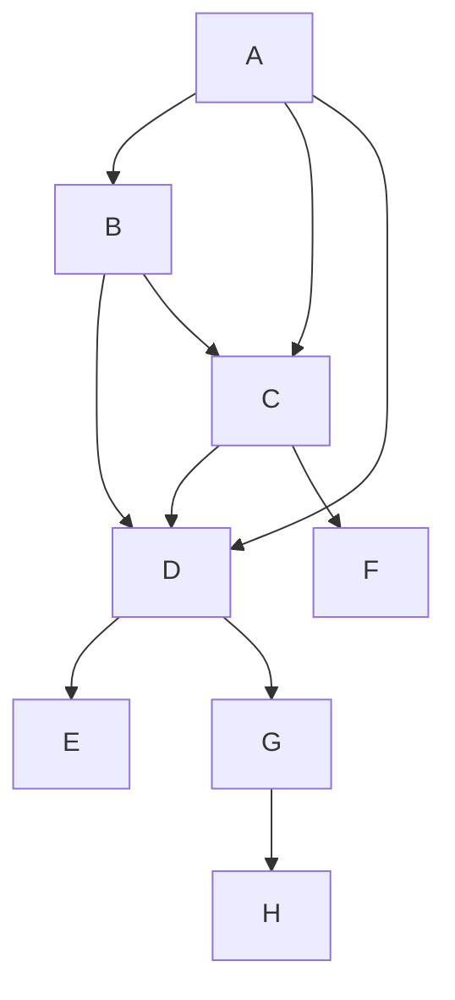

Test


Test 2
```mermaid
  graph TD;
pre_job-->build preamble-->build-docker preamble-->build-bare-metal preamble,build-docker,build-bare-metal-->build-bare-metal-eclide build-->ml-builds pre_job-->analyze pre_job-->build main-->succeeded build-docker --> ./.github/workflows/build-docker.yml ;
build-docker-->main main-->succeeded build-workflow-dispatch --> ./.github/workflows/build-docker.yml ;
build-workflow-dispatch-->test-workflow-dispatch --> ./.github/workflows/test-smoke-gh_runner.yml ;
build-docker-ubuntu-23_10 --> ./.github/workflows/build-docker.yml ;
build-docker-ubuntu-22_04 --> ./.github/workflows/build-docker.yml ;
build-docker-ubuntu-22_04-->test-smoke-docker-ubuntu-22_04 --> ./.github/workflows/test-smoke-gh_runner.yml ;
test-regression-suite-k8s-ubuntu-22_04 --> ./.github/workflows/test-regression-suite-k8s.yml ;
build-docker-ubuntu-22_04-->test-unit-docker-ubuntu-22_04 --> ./.github/workflows/test-unit-gh_runner.yml ;
build-docker-ubuntu-22_04-->test-ui-docker-ubuntu-22_04 --> ./.github/workflows/test-ui-gh_runner.yml ;
build-docker-ubuntu-20_04 --> ./.github/workflows/build-docker.yml ;
build-docker-centos-8 --> ./.github/workflows/build-docker.yml ;
build-docker-centos-7 --> ./.github/workflows/build-docker.yml ;
build-docker-amazonlinux --> ./.github/workflows/build-docker.yml ;
build-gh_runner-ubuntu-22_04 --> ./.github/workflows/build-gh_runner.yml ;
build-gh_runner-ubuntu-20_04 --> ./.github/workflows/build-gh_runner.yml ;
build-gh_runner-windows-2022 --> ./.github/workflows/build-gh_runner.yml ;
build-gh_runner-windows-2019 --> ./.github/workflows/build-gh_runner.yml ;
build-gh_runner-macos-12 --> ./.github/workflows/build-gh_runner.yml ;
build-gh_runner-macos-11 --> ./.github/workflows/build-gh_runner.yml ;
```
